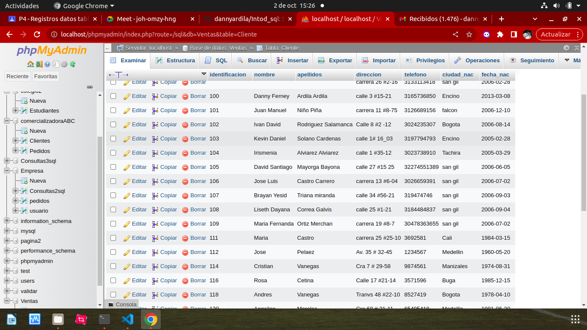
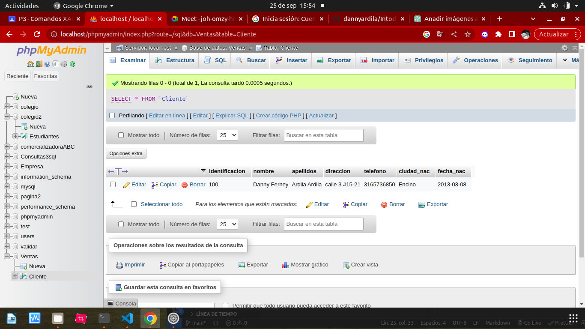
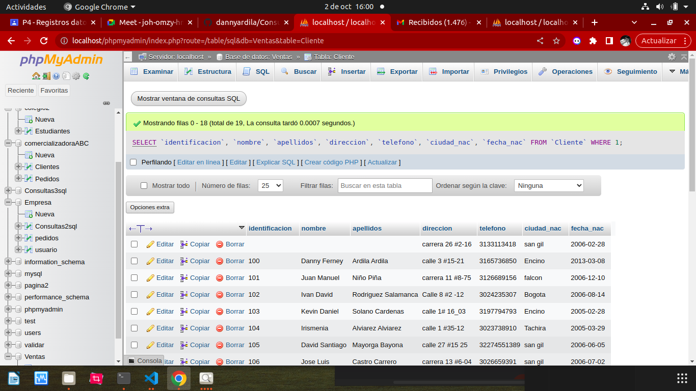
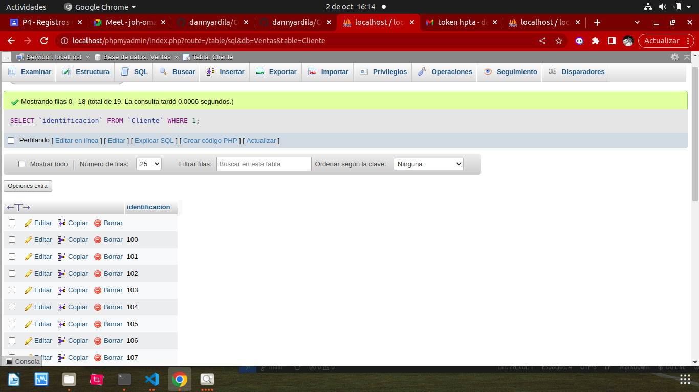
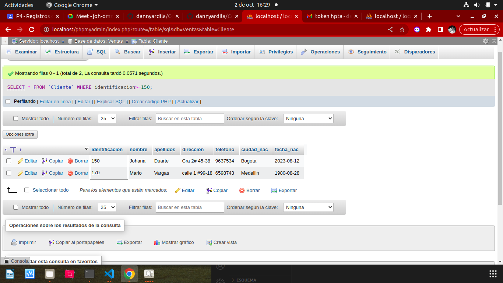
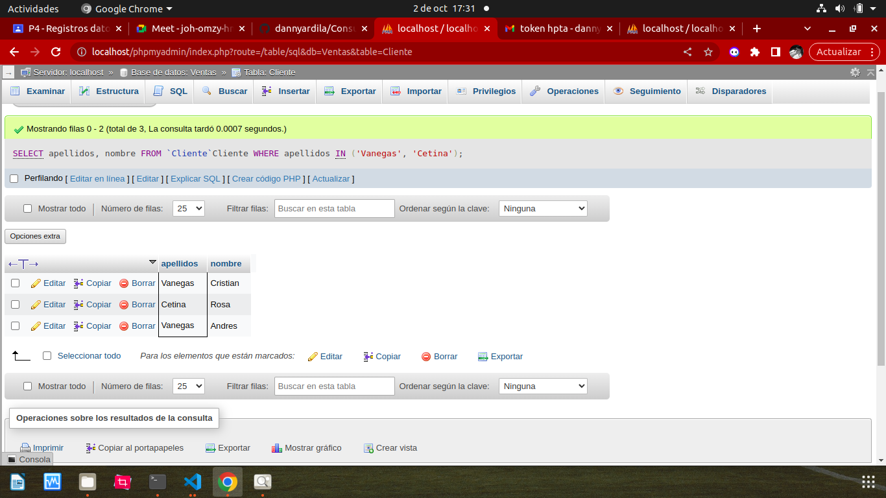
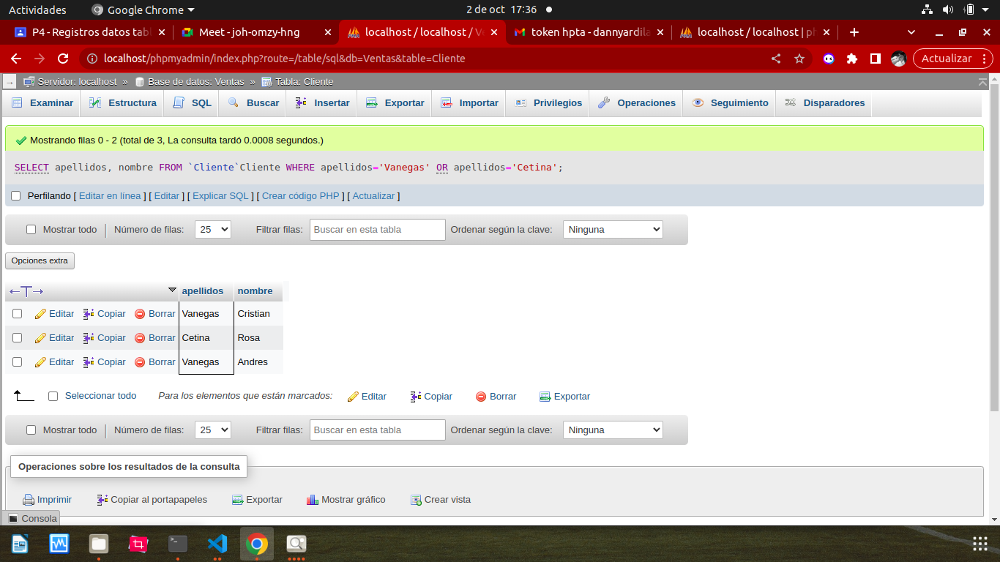
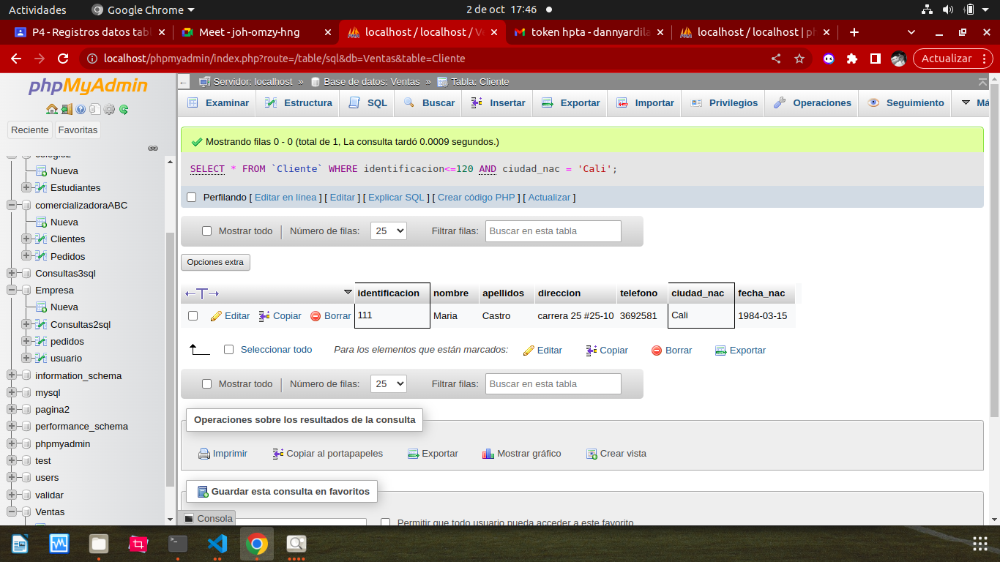
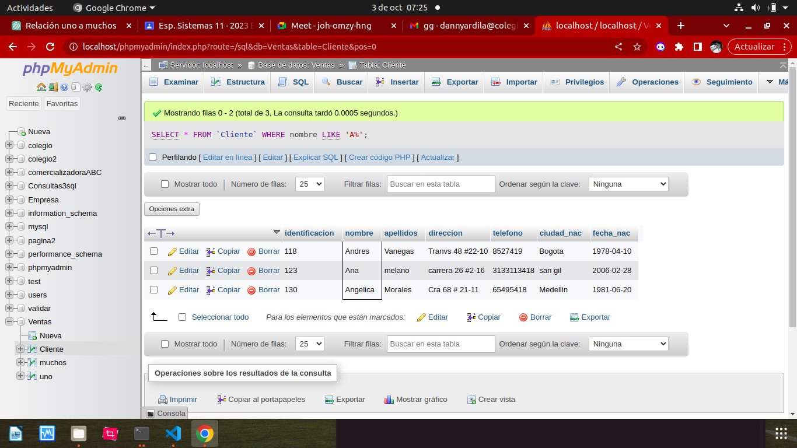
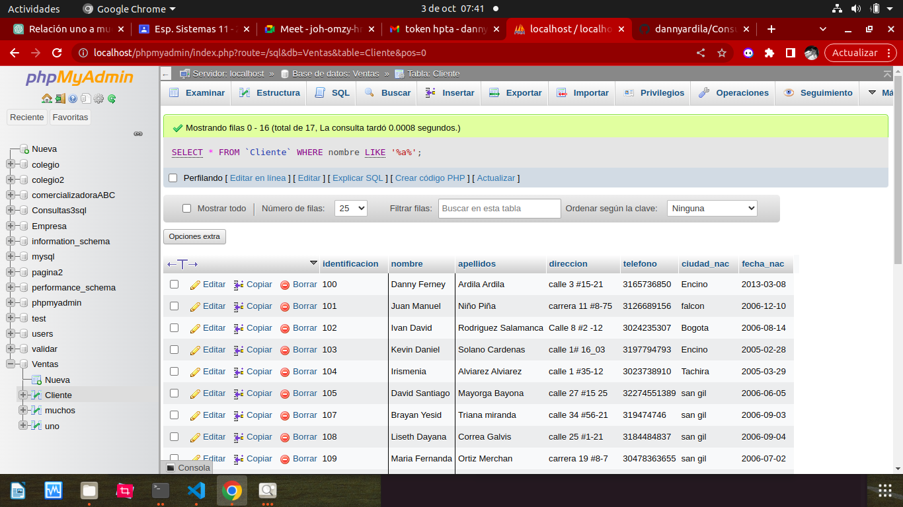

# Consultas1__sql
# Introduccion a una consultas BD usando el lenguaje sql

## Base de datos: Ventas
## Tabla: cliente

## Instruccion Select
-Permite seleccionar datos de una tabla.
-Su formato es:`SELECT campos_tablas FROM nombre_tabla`

### Consulta NO. 1
1.Para visualizar toda la informacion que contiene la tabla Cliente sse puede incluir con la instruccion SELECT el caracter **/*** o cada uno de los campos de la tabla.

-`SELECT * FROM Cliente`

-`SELECT identificacion, nombre, apellidos, direccion, telefono, ciudad_nac, fecha_nac FROM Cliente`

### Consulta No. 2

2. Para visualizar solamente la identificacion del cliente: `SELECT identificacion FROM Cliente`

### Consulta No. 3

3. Si se desea obtener los registros cuya iden tficacion sea mayor o igual a 150, se debe utilizar la clausula `WHERE` que especifica las condicciones que deben reunir los registros que van a seleccionar: `SELECT * FROM Cliente WHERE identificacion>=150`

### Consulta No. 4

4. Se desea obtener los registros cuyos apellidos sean Vanegas o Cetina, see debe utilizar el operador `IN` que especifica los registros que se quieren visualizar de una tabla.

`SELECT apellidos FROM Cliente WHERE apellidos IN ('Vanegas', Cetina')`

O se puede utilizar el operador `OR`
`SELECT apellidos FROM Cliente WHERE apellidos ='Vanegas'OR apellidos = 'Cetina'`

### Consulta No. 5

5. Se desea obtener los registros cuya identificacion sea menor de 110 y la ciudad sea  Cali, se debe utilizar el operador `AND`

`SELECT * FROM Cliente WHERE identificacion<=110 AND ciudad_nac = 'Cali'`

### Consulta No. 6

6. Si se desea obtener los registros cuyos nombres empiecen por la letra 'A', se debe utilizar el operador `LIKE` que utiliza los patrones `%` (todos)y `_` (caracter).

`SELECT * FROM Cliente WHERE nombre LIKE 'A%'`

### Consulta No.7

7. Se desea obtener los registros cuyos nombres contengan la letra 'a'

`SELECT * FROM Cliente WHERE nombre LIKE '%a%'`

### Consultas No.8

8. l

