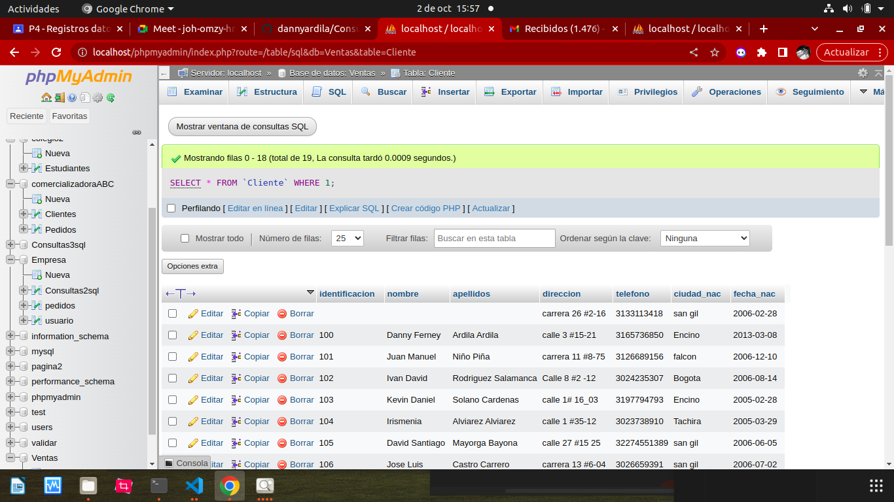

# Consultas1__sql
# Introduccion a una consultas BD usando el lenguaje sql

## Base de datos: Ventas
## Tabla: cliente

## Instruccion Select
-Permite seleccionar datos de una tabla.
-Su formato es:`SELECT campos_tablas FROM nombre_tabla`

### Consulta NO. 1
1.Para visualizar toda la informacion que contiene la tabla Cliente sse puede incluir con la instruccion SELECT el caracter **/*** o cada uno de los campos de la tabla.

-`SELECT * FROM Cliente`

-`SELECT identificacion, nombre, apellidos, direccion, telefono, ciudad_nac, fecha_nac FROM Cliente`

### Consulta No. 2

2. Para visualizar solamente la identificacion del cliente: `SELECT identificacion FROM Cliente`

### Consulta No. 3

3. Si se desea obtener los registros cuya iden tficacion sea mayor o igual a 150, se debe utilizar la clausula `WHERE` que especifica las condicciones que deben reunir los registros que van a seleccionar: `SELECT * FROM Cliente WHERE identificacion>=150`

